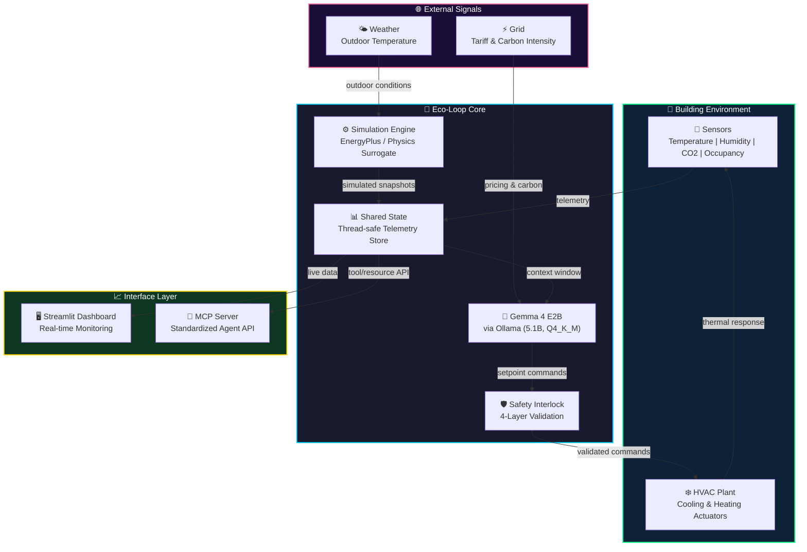
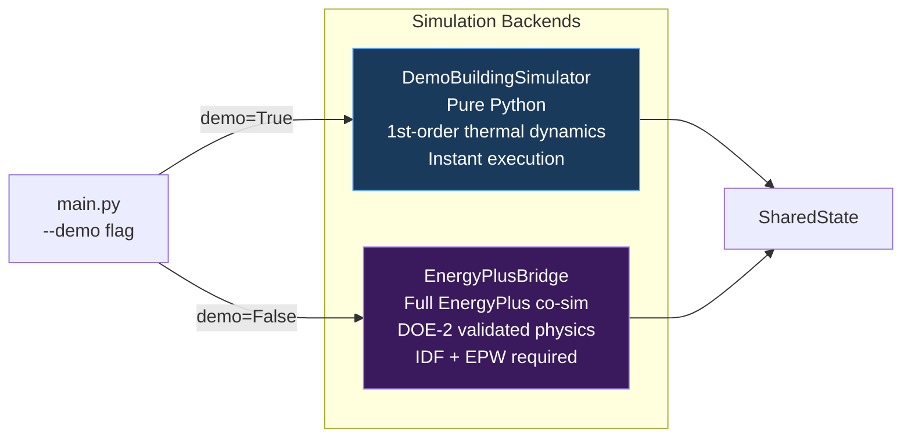
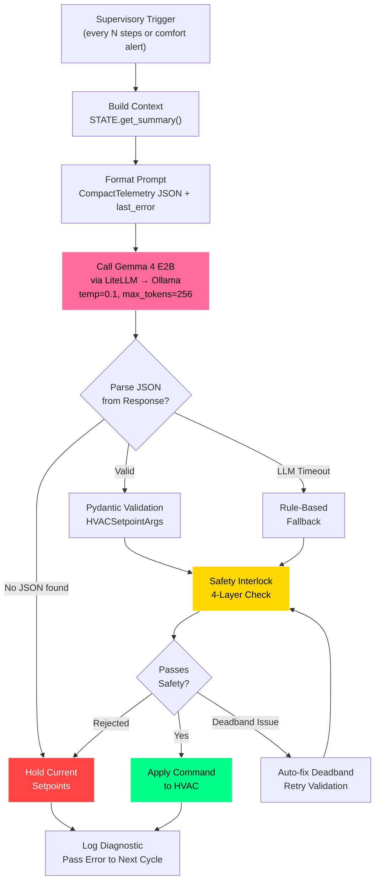
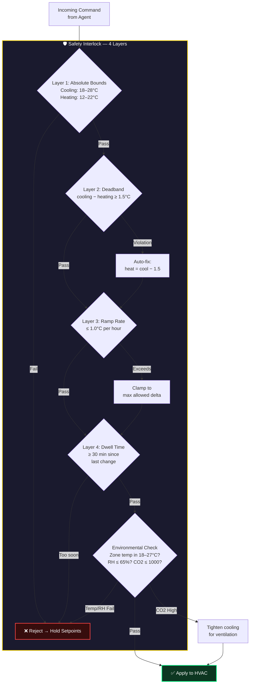
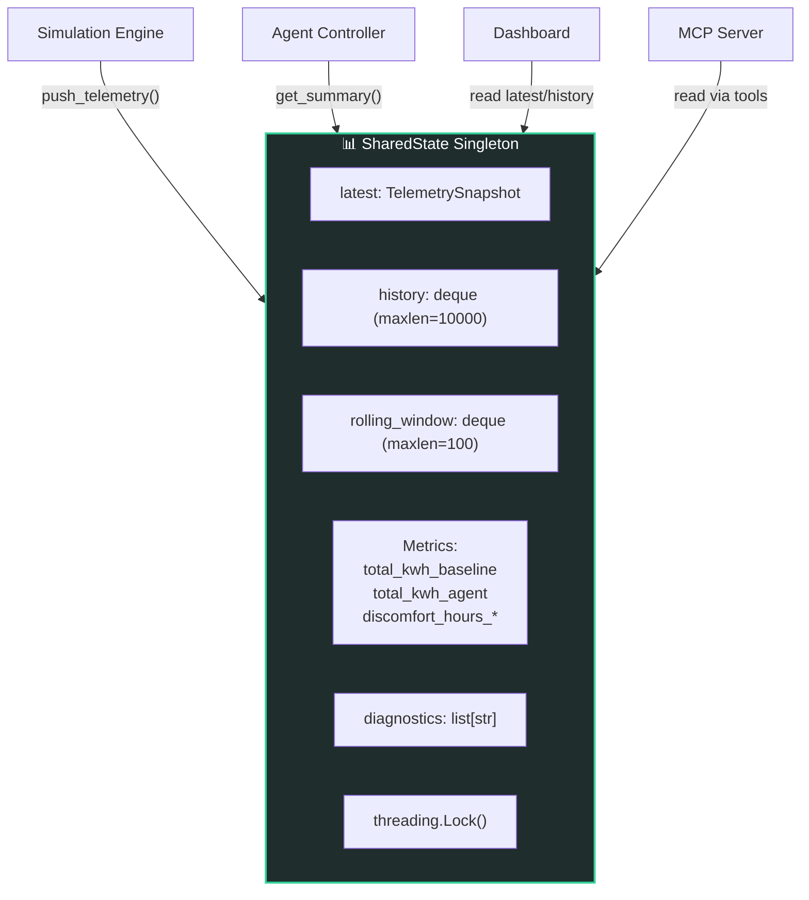
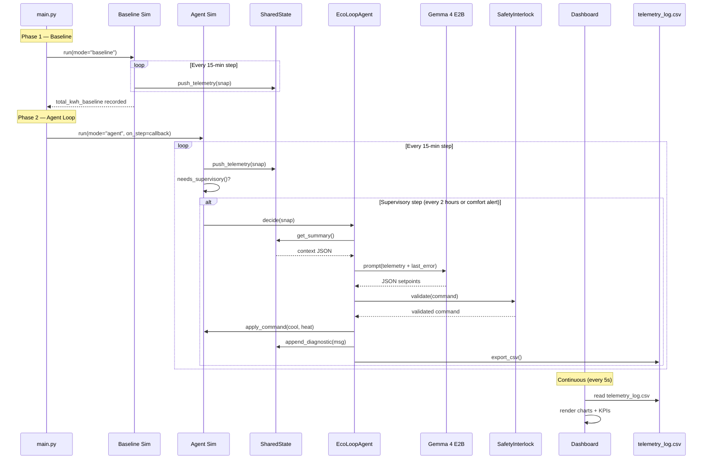
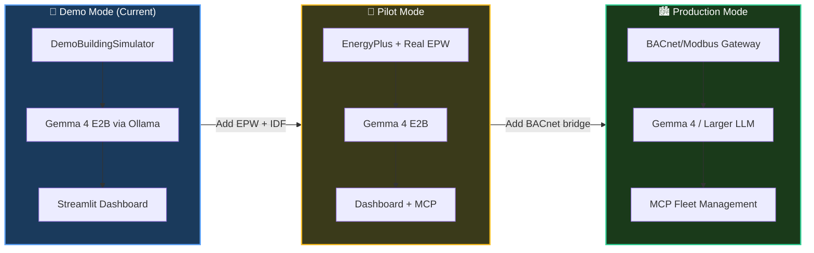

# Eco-Loop Architecture

> Autonomous closed-loop building energy optimization using Gemma 4 E2B, EnergyPlus, and Model Context Protocol.

---

## System Overview

Eco-Loop transforms a building from a passive energy consumer into an **autonomous, self-correcting agent**. The system pairs a physics-based simulation engine with an open-source LLM to continuously optimize HVAC setpoints across three objectives: **energy cost**, **carbon emissions**, and **occupant comfort**.



---

## Project Structure

```
honeywell_track1/
├── main.py                          # Orchestrator — baseline + agent loop + checkpointing
├── config_loader.py                 # YAML config → dataclass mapping
│
├── config/
│   ├── settings.yaml                # All tunable parameters
│   ├── baseline_medium_office.idf   # EnergyPlus building model (stub)
│   └── WEATHER_README.md            # Instructions for EPW download
│
├── agent/
│   ├── __init__.py
│   ├── controller.py                # EcoLoopAgent — LLM inference + fallback logic
│   ├── safety.py                    # SafetyInterlock — 4-layer command validation
│   ├── prompts.py                   # System & user prompt templates for Gemma 4 E2B
│   ├── schemas.py                   # Pydantic schemas (CompactTelemetry, HVACSetpointArgs)
│   └── mcp_client.py                # MCP client helper
│
├── simulation/
│   ├── demo_engine.py               # DemoBuildingSimulator — physics surrogate (no EnergyPlus)
│   ├── eplus_bridge.py              # EnergyPlusBridge — full EnergyPlus co-simulation
│   ├── shared_state.py              # SharedState singleton — thread-safe telemetry store
│   └── comfort.py                   # PMV calculation + grid signal functions
│
├── mcp_server/
│   ├── __init__.py
│   └── server.py                    # FastMCP server with tools & resources
│
├── dashboard/
│   └── app.py                       # Streamlit real-time dashboard
│
├── output/                          # Simulation outputs (telemetry CSV, checkpoints)
├── docs/                            # Documentation
│   └── ARCHITECTURE.md              # This file
├── requirements.txt
└── README.md
```

---

## Component Deep Dive

### 1. Simulation Engine

Two interchangeable backends behind a common interface:



**Demo Engine Physics Model:**
```
zone_temp += 0.25 × (target − zone_temp) + 0.08 × (outdoor − zone_temp) + 0.03 × occupancy
humidity  = clamp(RH + 0.1 × (zone_temp − 23.0), 35%, 70%)
CO2       = 400 + 450 × occupancy + 5 × (zone_temp − 22.0)
power     = base_load + cooling_load × occupancy + outdoor_heat_gain
```

**Timestep:** Configurable (default 15 minutes)
**Run Period:** Configurable (default 1–7 days)

---

### 2. Agent Controller (EcoLoopAgent)

The cognitive engine that decides HVAC setpoints every supervisory interval.



**Self-Correction Mechanism:**
- If the LLM produces invalid JSON → setpoints are held, error is injected into the *next* prompt via `last_error`
- The LLM sees its own mistake and corrects on the next cycle
- If the LLM is completely unavailable → rule-based fallback takes over (no interruption)

**LLM Prompt Design (Compact):**
```
System: "You are Eco-Loop HVAC supervisor. Output ONLY JSON:
         {heating_setpoint_c, cooling_setpoint_c, rationale}"

User:   "telemetry={compact_json} last_error={error_or_none}
         Return setpoints JSON only."
```

---

### 3. Safety Interlock

A **deterministic, non-bypassable** validation layer between the LLM and the HVAC actuators.



**Key Safety Parameters (from `config/settings.yaml`):**

| Parameter | Value | Purpose |
|-----------|-------|---------|
| `cooling_min / max` | 18°C / 28°C | Absolute cooling bounds |
| `heating_min / max` | 12°C / 22°C | Absolute heating bounds |
| `min_deadband` | 1.5°C | Prevents cool/heat fighting |
| `max_ramp_c_per_hour` | 1.0°C | Prevents thermal shock |
| `min_dwell_minutes` | 30 min | Prevents oscillation |

---

### 4. Shared State (Thread-Safe Singleton)

Central data store accessed by simulation, agent, dashboard, and MCP server concurrently.



**TelemetrySnapshot Fields:**
| Field | Type | Description |
|-------|------|-------------|
| `zone_temp_c` | float | Current zone temperature |
| `outdoor_temp_c` | float | Outdoor temperature |
| `zone_rh_percent` | float | Relative humidity |
| `zone_co2_ppm` | float | CO2 concentration |
| `pmv` | float | Predicted Mean Vote comfort index |
| `elec_power_kw` | float | Electrical power consumption |
| `cooling_setpoint_c` | float | Active cooling setpoint |
| `heating_setpoint_c` | float | Active heating setpoint |
| `grid_tariff_usd_kwh` | float | Current electricity price |
| `grid_carbon_gco2_kwh` | float | Current grid carbon intensity |
| `sim_day` / `sim_hour` | int/float | Simulation time |

---

### 5. MCP Server

Exposes building telemetry and control via the **Model Context Protocol**, enabling any MCP-compatible AI agent to interact with the building.

**Tools:**
| Tool | Description |
|------|-------------|
| `apply_hvac_setpoints` | Set cooling/heating setpoints (validated through SafetyInterlock) |
| `get_telemetry` | Current building telemetry snapshot |
| `get_diagnostics` | Agent decision log |

**Resources:**
| URI | Description |
|-----|-------------|
| `eco-loop://telemetry/latest` | Latest telemetry as JSON |
| `eco-loop://metrics/summary` | Energy savings & comfort metrics |

---

### 6. Dashboard

Real-time Streamlit dashboard with auto-refresh.

**Tabs:**
| Tab | Content |
|-----|---------|
| Overview | KPI cards (savings %, kWh, comfort hours) |
| Thermal Comfort | Zone temp, PMV, setpoint timeseries |
| Setpoints & Grid | Setpoint history, tariff overlay, carbon intensity |

---

## Data Flow — Complete Closed Loop



---

## Configuration Reference

All parameters in `config/settings.yaml`:

| Section | Key | Default | Description |
|---------|-----|---------|-------------|
| `llm` | `model` | `gemma4:e2b` | Ollama model name |
| `llm` | `temperature` | `0.1` | Low for deterministic outputs |
| `llm` | `max_tokens` | `2048` | Max response length |
| `llm` | `timeout_seconds` | `300` | LLM call timeout |
| `simulation` | `timestep_minutes` | `15` | Simulation granularity |
| `simulation` | `run_period_days` | `1` | Simulation duration |
| `simulation` | `supervisory_interval_minutes` | `120` | LLM decision frequency |
| `simulation` | `demo_mode` | `false` | Use surrogate vs EnergyPlus |
| `setpoints` | `min_deadband` | `1.5` | Min cool−heat gap |
| `setpoints` | `max_ramp_c_per_hour` | `1.0` | Max temperature change rate |
| `setpoints` | `min_dwell_minutes` | `30` | Min time between changes |
| `objective_weights` | `alpha_cost` | `1.0` | Energy cost weight |
| `objective_weights` | `beta_carbon` | `0.8` | Carbon emission weight |
| `objective_weights` | `gamma_comfort` | `2.5` | Occupant comfort weight |

---

## Deployment Modes


